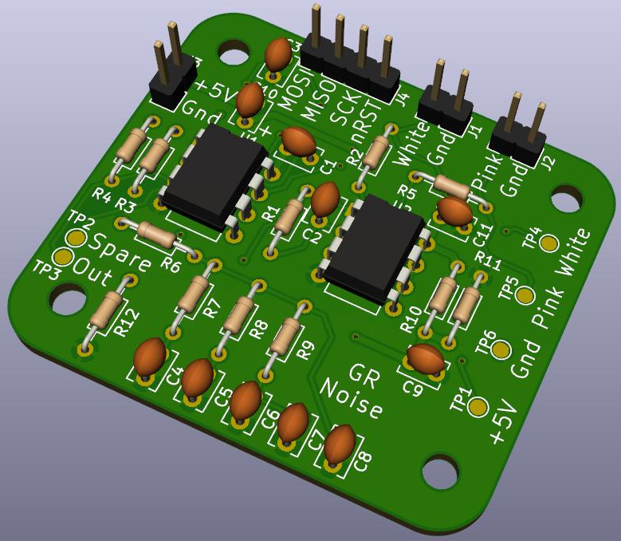

   
White and Pink noise generating PCB 
Uses a linear feedback shift register in an ATTiny85 to generate pseudo random white noise 
Then uses a -3 dB/octave low pass RC filter to convert to pink noise. 
ATTiny Sketch: https://github.com/GadgetReboot/White_Noise_LFSR
